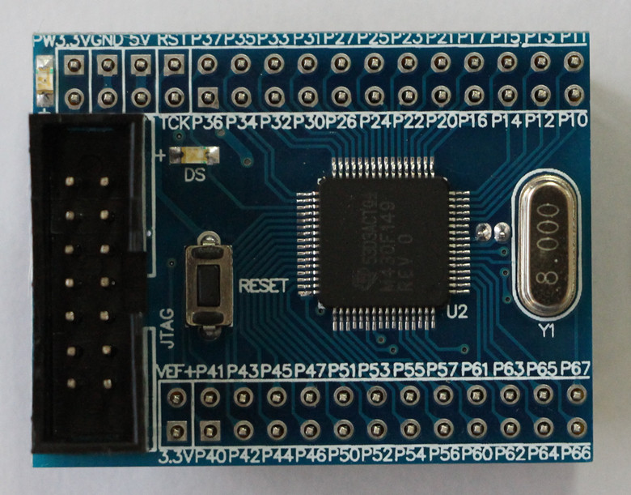
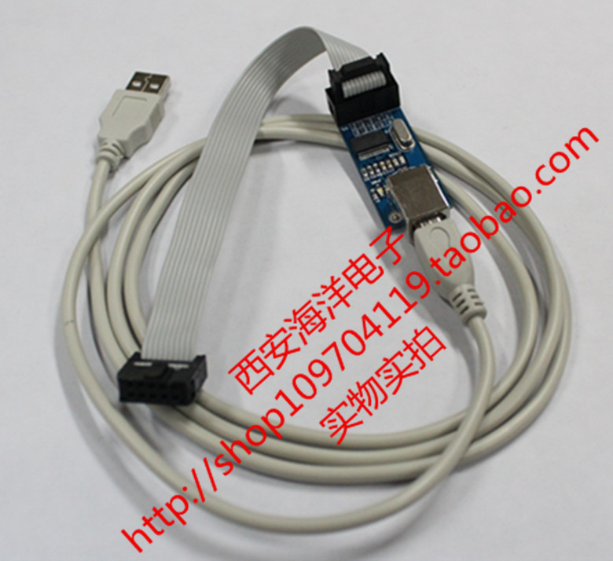
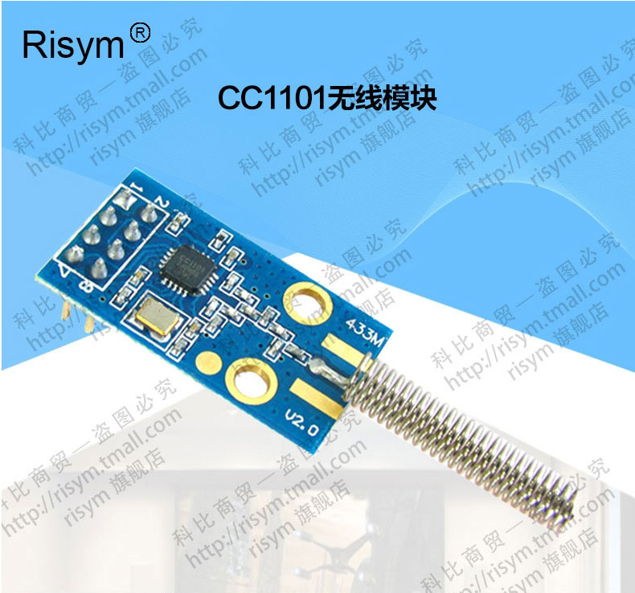

# msp430_cc1101
Use MSP430F149 to control CC1101 transceiver

## Purpose
Long before I had used CC1000 to make some RF module, and did a lot of range outreaching test with it. At that time, this IC 's maker is still Chipcon. Nowadays, Chipcon is required by TI, and the series evolves to CC1101, with more powerful function, such as FIFO mechanism. I am doing some study about Energy Harvesting project, using piezo material to power an RF transmitter. Power consumption is the key consideration. So I choose ultra low power MSP430 and CC1101 for test. 

## Details
__MSP430F149__ is a 16-bit RISC MCU, with 2KB RAM, 60KB FLASH and 256 B FLASH. Why I choose this one? It may not be the cheapest IC but the cheapest evaluation board I can get from online retail store in China. picture below:   {:width="300px"}

__BSL download board__  For program downloading. With picture below: 

__IAR embedded work bench for MSP430__  IDE tool

__CC1101 module__ Made for 433MHz, spring-like coil antenna installed. picture below: 

### file structure
The code is modified from TI reference code (source_rev_113.rar ).  I found some problems in IO initialization, whcih caused GDO0 interrupt not function, and correct it. 

#### hal
This is Hardware Abstraction Layer to hide MCU implementaion below. So you can use different MSP430 MCU type.
..
common/      It is not common function. SPI api and cc1101 rf control API. Change it if you are using another transceiver, for example , 2.4GHz one.

hal_430f149/ board, io definiton, MCU type highly related. 

include/  Basic type definitions and HAL API.

#### app
This is the application code. Everytime you need to compile it in IAR, just add the main*.c file into the project as the main-entry file. Remove the old one of course.

cc1101tx/  Contains a tx program.

cc1101rx/  Contains a RX program.

try/   Contains a basic test program with UART 9600bps function.

## PS
For later reference. Hope can help others.

